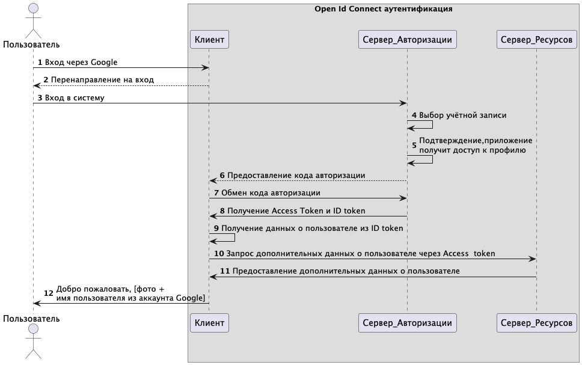

# 🔐 OpenID Connect (Google) Authentication – Spring Security

Микросервис реализует схему аутентификации через внешний провайдер Google по протоколу OpenID Connect (OIDC), используя Spring Security.

Разработка выполнена в рамках выпускной квалификационной работы:

> **Анализ современных методов аутентификации: устойчивость к угрозам информационной безопасности и перспективы развития беспарольных технологий**  
> НИУ ВШЭ, направление "Информационная безопасность", Федосов М.И., 2025

---

## 📌 Описание

OpenID Connect (OIDC) — это протокол, построенный поверх OAuth 2.1, который позволяет аутентифицировать пользователей через сторонние сервисы, такие как Google, без хранения паролей на стороне приложения.



Микросервис:

- Подключается к Google как внешний провайдер аутентификации.
- Позволяет пользователю войти в приложение с помощью своего Google аккаунта.
- Предоставляет защищённую конечную точку `/hello`, доступную только после успешной аутентификации.
- Выполняет анализ безопасности аутентификации через внешний OpenID-провайдер.

---

## 🧩 Технологии

- Java 21
- Spring Boot 3
- Spring Security + OAuth2 Client (`spring-boot-starter-oauth2-client`)
- Maven

---

## ⚙️ Запуск проекта

0. Скопировать проект:
```bash
git clone https://github.com/m-fedosov/authentication_oidc.git
cd authentication_oidc
```
1. Создать OAuth 2.0 Client ID в [Google Cloud Console](https://console.cloud.google.com/apis/credentials).
2. Указать `http://localhost:8081/login/oauth2/code/google` как redirect URI.
3. Вставь значения в `application.properties`:

```yaml
spring.security.oauth2.client.registration.google.client-id=YOUR_CLIENT_ID
spring.security.oauth2.client.registration.google.client-secret=YOUR_CLIENT_SECRET
```

4. Запуск Spring-приложения:
```bash
./mvnw spring-boot:run
```
